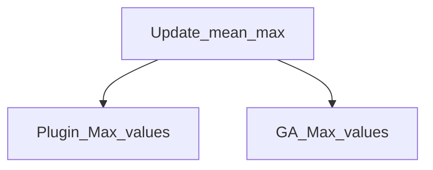

# TMA Dependency Architecture — Update_mean_max
Generated via `app/dependency/dependency_analyzer.py` (DependencyAnalyzer) + `app/dependency/graph_builder.py` (DependencyGraphBuilder, networkx-backed) against all 4 job items in the repository.

## Parent Jobs
| Job | Out-degree | Role |
|---|---|---|
| Update_mean_max | 2 | Orchestrator — only job with `tRunJob` references |

## Child Jobs
| Job | In-degree | Invoked by |
|---|---|---|
| Plugin_Max_values | 1 | Update_mean_max (tRunJob_1) |
| GA_Max_values | 1 | Update_mean_max (tRunJob_3) |

Dependency statistics (DependencyGraphBuilder.analyze): nodes=4, edges=2, parent_jobs=1, child_jobs=2, circular_dependencies=0, max_depth=1.
Dependency chains: `[Update_mean_max → GA_Max_values]`, `[Update_mean_max → Plugin_Max_values]`.
Note: `Test_Plugin_Max_values` (pre-migration test job) has no tRunJob links to/from the other 3 — isolated node in the graph.

## Joblets
`JobletProfiler.profile()` → `joblet_usage_matrix = []`, `joblet_dependency_matrix = {}`.
**None found.** No `tJoblet*` components exist in any of the 4 job items.

## Routines
Common system routines detected (DependencyAnalyzer.extract_routines, regex-matched against component params) — same 8-routine library bundled per job: StringHandling, TalendDate, Numeric, DataOperation, Relational, Mathematical, TalendString, TalendDataGenerator.
Used by: Plugin_Max_values, GA_Max_values, Test_Plugin_Max_values (custom tMap expressions call `StringHandling.COUNT`, `StringHandling.EREPLACE`, `TalendDate.getCurrentDate()`). Update_mean_max references the same routine namespace but with no custom expression calls (orchestration only).

## Context Groups
`ContextProfiler.profile()` → `repository_context_matrix`:
| Job | Context Group | Variables |
|---|---|---|
| Update_mean_max | Default | companyid, host, port, username, database, StartDate, EndDate |
| Plugin_Max_values | Default | companyid, host, port, username, database, startdate, enddate |
| GA_Max_values | Default | companyid, host, port, username, database, startdate, enddate |
| Test_Plugin_Max_values | Default | companyid, startdate, enddate, localhost_Sriyaplugin_Server/Port/Login/Database/AdditionalParams |

Shared contexts (used by 2+ jobs): companyid, database, enddate, host, port, startdate, username, Default.
Duplicate-value conflicts: none detected. Environment-suffixed contexts (dev/qa/prod): none detected.

## External Files
No `tFileInput*`/`tFileOutput*` components found (`grep componentName="tFile*"` = empty across all 4 jobs) — **no external file dependencies**. Only external reference is the implicit context-load file path (`IMPLICIT_TCONTEXTLOAD_FILE`) pointing to a local `D:\...` properties file used for DB connection metadata, not job data.

## Mermaid Dependency Graph
Generated via `app/tiap/graph/mermaid_generator.py` → `MermaidGenerator().repository_dependency_diagram(all_jobs)`, reusing `DependencyGraphBuilder.build()`:

